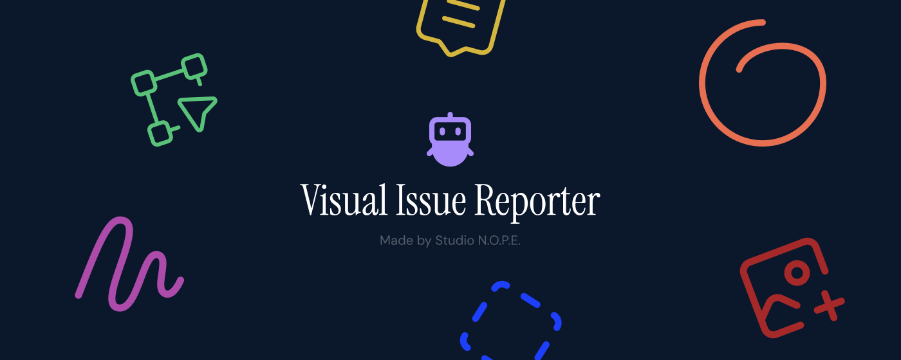

<p align="center">
  
</p>

# Visual Issue Reporter

> Report visual issues without switching context. Shorter dev cycles, everyone can contribute, not just developers.

Chrome extension that captures annotated screenshots, records screen videos with narration, and creates GitHub issues with full browser context. Built for teams that move fast.

---

### About Studio N.O.P.E.

**Creative Solution Engineers using AI's infinite possibilities to help humans realise their dreams.**

We're [@tijsluitse](https://github.com/tijsluitse) and [@basfijneman](https://github.com/basfijneman) — two guys who believe the best tools are the ones that get out of your way. We built Visual Issue Reporter because reporting bugs shouldn't require a 12-step process and a screenshot tool. It should be one click, some context, done.

We made this open source because we think every team deserves better dev tools, not just the ones that can afford them. When you fix a bug faster, everyone wins — developers, designers, clients, and the people using the product. Open source means the community can shape this into exactly what they need.

**Want to work with us?** We help teams build smarter workflows with AI-powered tooling, Shopify development, and creative engineering. Reach out at **info@studionope.nl** or visit [studionope.nl](https://studionope.nl).

---

## Features

- **Screenshot & annotate** — capture any region, draw freehand or straight lines (hold Shift), add text comments, place images
- **Screen recording** — record your tab with optional microphone narration, draw on the page while recording
- **Three tools** — Select (region), Canvas (annotate), Inspect (pick DOM elements)
- **GitHub issues** — creates issues with screenshot, video recording, environment info, HTML snippets, and console errors
- **Shopify-aware** — detects store, theme, template, and environment (live/preview/editor/local)
- **Side panel UI** — repo selector, label/assignee pickers, page issues list
- **Auto-fix with Claude** — add the `auto-fix` label to trigger Claude Code for AI-powered fixes
- **Keyboard shortcuts** — D (draw), V (pointer), S (select), C (comment), Shift (straight lines), Ctrl+C (copy canvas)
- **Theming** — multiple visual themes with secret unlock codes
- **Copy to clipboard** — Ctrl+C copies the annotated canvas as a PNG

---

## Installation

### Chrome Web Store

Install from the [Chrome Web Store](https://chromewebstore.google.com) (search "Visual Issue Reporter").

### Manual install

1. Download [visual-issue-reporter.zip](https://github.com/N-O-P-E/visual-issue-reporter/releases/latest/download/visual-issue-reporter.zip)
2. Unzip the file
3. Go to `chrome://extensions`, enable **Developer mode**
4. Click **Load unpacked** and select the unzipped folder

### Setup

1. Click the extension icon to open the side panel
2. Follow the onboarding wizard
3. Add your **GitHub Personal Access Token** ([create one](https://github.com/settings/tokens/new) with `repo` scope)
4. Search and add repositories to report issues to

---

## Usage

### Reporting a visual issue

1. Navigate to the page with the issue
2. Select a target repo in the side panel
3. Pick a tool — **Select** to highlight a region, **Canvas** to draw/annotate, or **Inspect** to pick a DOM element
4. Annotate the screenshot with drawing, text, or images
5. Fill in a description, pick labels and assignee
6. Submit — the issue is created on GitHub with the annotated screenshot and full context

### Screen recording

1. Click **Record** in the side panel
2. Select the tab to record in Chrome's picker
3. Use **D** to draw on the page, **V** to switch back to pointer mode
4. Click **Stop** when done — the video uploads automatically
5. Submit the issue with the recording attached

### Microphone narration

Toggle **Microphone** before recording to narrate while you capture. Chrome will ask for mic permission on first use.

### Auto-fix with Claude Code

1. Go to Settings > Auto-fix with Claude Code
2. Add your `ANTHROPIC_API_KEY` secret to the repo
3. Install the workflow file
4. Check **Auto-fix** when submitting an issue — Claude will analyze the codebase and propose a fix

---

## Development

### Prerequisites

- [Node.js](https://nodejs.org/) >= 22.15.1
- [pnpm](https://pnpm.io/) 10.x
- Google Chrome

### Getting started

```bash
git clone https://github.com/N-O-P-E/visual-issue-reporter.git
cd visual-issue-reporter
pnpm install
pnpm dev
```

Load `dist/` as an unpacked extension in `chrome://extensions` (Developer mode). Changes hot-reload.

### Commands

```bash
pnpm dev           # development build with HMR
pnpm build         # production build
pnpm zip           # build + zip for distribution
pnpm lint          # eslint
pnpm format        # prettier
pnpm type-check    # tsc across all workspaces
pnpm e2e           # end-to-end tests
```

### Project structure

```
chrome-extension/       manifest, background service worker
pages/
  side-panel/           side panel UI (repo selector, issue form, settings)
  content-ui/           page overlay (screenshot, annotation canvas, recording overlay)
  content/              content script (DOM inspection, main-world injection)
  popup/                extension popup
packages/
  shared/               message types, browser metadata, console capture, utilities
  ui/                   Tailwind config helper
  i18n/                 locale files
  env/                  environment flags
  hmr/                  hot module reload
  vite-config/          shared Vite setup
```

---

## Contributing

Contributions are welcome! Please open an issue first to discuss what you'd like to change.

---

## License

MIT

---

## Star History

<a href="https://www.star-history.com/?repos=N-O-P-E%2Fvisual-issue-reporter&type=timeline&legend=top-left">
 <picture>
   <source media="(prefers-color-scheme: dark)" srcset="https://api.star-history.com/image?repos=N-O-P-E/visual-issue-reporter&type=timeline&theme=dark&legend=bottom-right" />
   <source media="(prefers-color-scheme: light)" srcset="https://api.star-history.com/image?repos=N-O-P-E/visual-issue-reporter&type=timeline&legend=bottom-right" />
   
 </picture>
</a>
